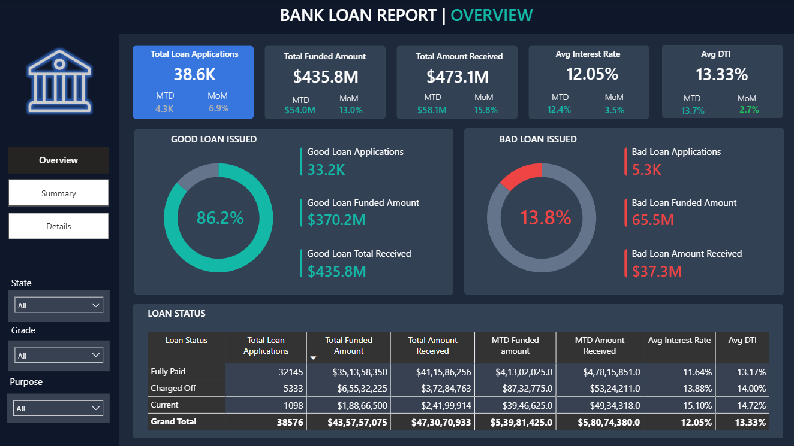
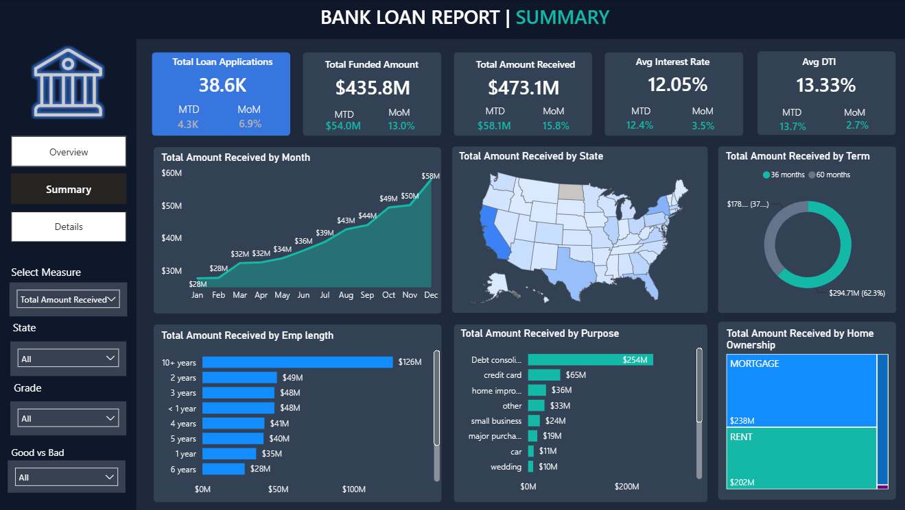
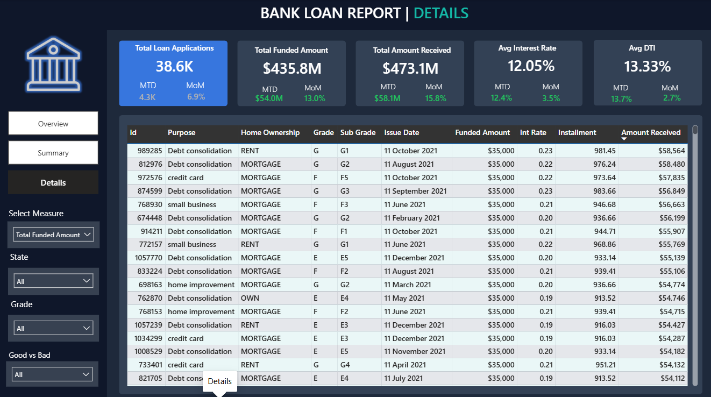

# 🏦 Bank Loan Analysis – Power BI

## 📌 Project Overview

An interactive **Power BI dashboard** analyzing **38,575 loan applications across 24 columns** to evaluate loan portfolio performance, loan quality, borrower characteristics, and lending patterns.

## 🖼️ Dashboard Preview



**Overview Page:** Provides a consolidated view of loan portfolio performance, including key KPIs, MTD and MoM trends, Good vs. Bad Loan analysis, loan status, and breakdowns across key loan dimensions.



**Summary Page:** Provides dynamic analysis using a DAX-based measure selector, allowing users to switch between Loan Applications, Funded Amount, and Amount Received across different loan and borrower dimensions.



**Details Page:** Provides a record-level view of individual loans, including key loan and borrower attributes for detailed analysis.

## 🎯 Project Objective

To evaluate **loan portfolio performance and quality** by analyzing loan applications, funded amounts, amount received, and Good vs. Bad Loan segments across key loan and borrower dimensions.

## ❓ Business Questions

- How is the overall loan portfolio performing?
- What are the **MTD and MoM** trends in loan applications, funded amount, and amount received?
- What is the distribution of **Good vs. Bad Loans**?
- How does loan performance vary by **State, Grade, and Purpose**?
- How do selected loan metrics vary by **Month, State, Term, Employment Length, Purpose, and Home Ownership**?

## 📂 Dataset

| | |
|---|---|
| 📊 Records | 38,575 |
| 📋 Columns | 24 |
| 📁 Source | CSV |
| 📄 Dataset | `financial_loan` |

## 🛠️ Tools & Technologies

**Microsoft Excel** • **Power BI** • **DAX**

## ⭐ Key Features

- 📌 Portfolio performance analysis
- 📅 MTD & MoM analysis
- 🟢 Good vs. Bad Loan segmentation
- 🔄 Dynamic measure selection
- 📊 Multi-dimensional analysis
- 🔎 Record-level analysis

## 📁 Project Structure

```text
🏦 Bank-Loan-Analysis/
│
├── 📁 Dataset/
│   └── 📄 financial_loan
│
├── 🖼️ images/
│   ├── overview_page.png
│   ├── summary_page.png
│   └── details_page.png
│
├── 📊 loan_analysis_dashboard
│
└── 📄 README.md


